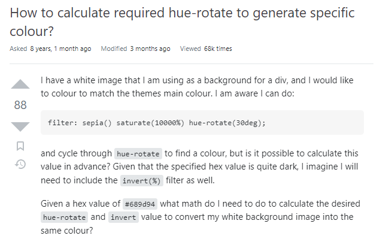

# HOW TO CALCULATE sepia() saturate() hue-rotate() TO RECOLOR A WHITE BACKGROUND IMAGE

the answer to the ultimate question



## don’t do that

if you are not inlining your svg icons  you have a small brain

## what if you can only use background-image????????????????

`mask` is the best way because it doesn’t require a `<clipPath>` tag in the svg and can be sized responsively using `mask-size`

```
.icon {
	background-color: hsl(
 		var(--h),
		var(--s),
		var(--l)
	);
	-webkit-mask-image: url('icon.svg');
	mask-image: url('icon.svg');
	-webkit-mask-size: cover;
	mask-size: cover;
	height: 24px;
	width: 24px;
}
```

## website

https://tinytinytinytiny.github.io/sepia-saturate-hue-rotate/